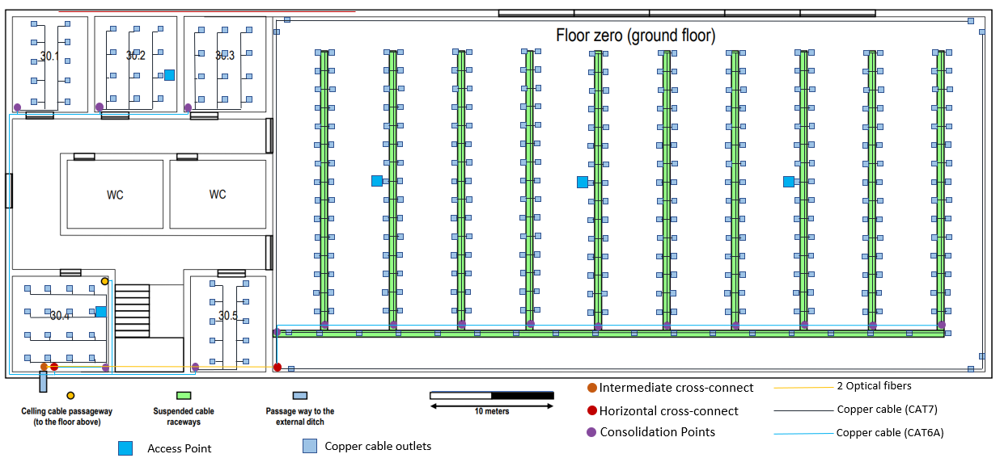
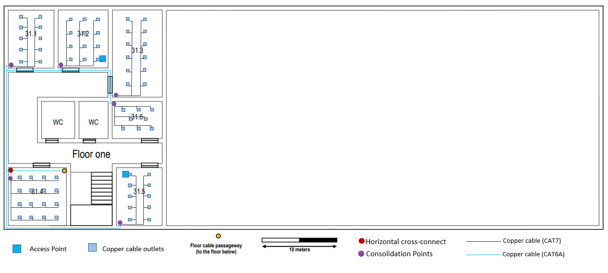
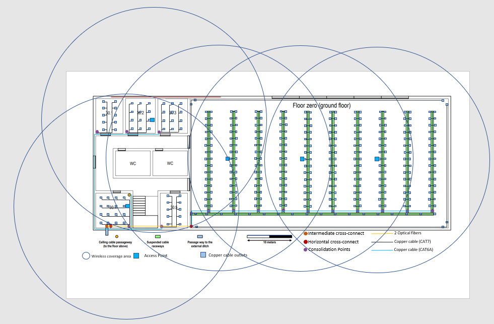
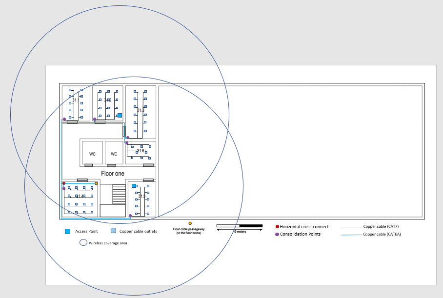

## Edifício 3

O edifício 3 é constituído por 2 pisos, cada piso tem dimensões de 80 x 30 metros.
O piso 0 tem 5 salas, 2 casas de banho, e uma área aberta que tem de altura os dois pisos. O piso 1 tem 6 salas e 2 casas de banho também. As casas de banho não foram medidas uma vez que nos foi dito que não iria ser necessário ter de colocar outlets nesssas salas.

#### Áreas

Para calcular as áreas das salas, utilizei a escala que nos foi fornecida.
Em que dez metros correspondiam a 5,21cm. Para a área aberta utilizamos uma relação em que 10 metros correspondiam a 3,2cm.

#### Outlets

A distribuição dos outlets foi feita a partir dos padrões de cablagem estruturada, ou seja, deve haver pelo menos 2 outlets por cada 10 metros quadrados de área. Além disso, uma outra regra que foi utilizada é que a distância máxima de qual quer ponto da sala ao outlet mais próximo tinha de ser menos de 3 metros.
Na área aberta foram comocados 7 outlets extra pelos cantos do espaço, para comprir a regra dos 3 metros.

### Ground Floor - Areas e outlets

#### Piso 0
| Medidas | C (cm)  | L (cm)  | C (m)  | L (m)  | A (m²)  |Outlets|
|---------|---------|---------|--------|--------|-------- |-------|
| 30.1    | 3,18    | 4,0     | 6,1    | 7,7    | 47,0    |  10   |
| 30.2    | 3.5     | 4,0     | 6,7    | 7,7    | 51,6    |  12   |
| 30.3    | 3,5     | 4,0     | 6,7    | 7,7    | 51,6    |  12   |
| 30.4    | 4,05    | 4,0     | 7,8    | 7,7    | 60,0    |  12   |
| 30.5    | 3,18    | 4,0     | 6,1    | 7,7    | 47,0    |  10   |
| Area G  | 18      | 9       | 56,25  | 28,12  | 1582    |318 + 7|
|         |         |         |        |        |         |       |
|TOTAL DE OUTLETS   |   381   |        |        |         |       |
|Area Total (m²)    |  1838,2 |        |        |         |       |

### First Floor - Areas e outlets

#### Piso 1
| Medidas | C (cm)  | L (cm)  | C (m)  | L (m)  | A (m²)  |Outlets|
|---------|---------|---------|--------|--------|-------- |-------|
| 31.1    | 3,18    | 4,0     | 6,1    | 7,7    | 47,0    |  10   |
| 31.2    | 3,5     | 4,0     | 6,7    | 7,7    | 51,6    |  12   |
| 31.3    | 3,5     | 6,0     | 6,7    | 11,5   | 77,05   |  16   |
| 31.4    | 4,05    | 4,0     | 7,8    | 7,7    | 60,0    |  12   |
| 31.5    | 3,18    | 4,0     | 6,1    | 7,7    | 47,0    |  10   |
| 31.6    | 3,5     | 2,6     | 6,7    | 5,0    | 33,5    |   8   |
|         |         |         |        |        |         |       |
|TOTAL DE OUTLETS   |   68    |        |        |         |       |
|Area Total (m²)    | 316,15  |        |        |         |       |

#### Cablagem

No piso 0, foram utilizados cabos de fibra ótica para a conexão entre o IC e os HC's.
Colocou-se dois cabos de fibra por cada linha na imagem por causa de dois processos. Failover e load balancing, se acontecer alguma falha, todo o conjunto de cabos não será danificado e além disso haverá maior banda larga, a carga vai ser dividida pelos dois fios.
Os restantes cabos, quer no piso 0 ou 1, são de cobre.
Como se deve evitar juntar cabos de cobre (CAT7) devido à interferência eletromagnética, decidi só colocalos entre os HC's e os CP's. Dentro das salas, foram usados cabos de cobre (CAT6A).

#### Access Points

Em relação aos Access Points, foram colocados 5 no piso 0, apesar do comprimento do edificio parecer que não precisa de tantos access point, uma vez que cada um tem um diametro de 50 m (só eram necessário dois) decidi colocar mais 3 porque, as paredes causam interferência e apesar de chegar a 50 metros, se já tivermos muito afastados do access point a potência do sinal já é muito pequena.
No piso 1, existem 2 access points porque o espaço é muito mais pequeno, a área aberta já tem wireless.
Os access points, estão obviamente pertos de uma tomada.

##### Piso 0

##### Piso 1

#### Cross-connects

O intermediate cross-connect foi colocado na sala 30.4, dado que é aí que se encontra a passagem para a vala externa, havendo uma poupança nos cabos de fibra.
Na sala 30.4 também se encontra um horizontal cross-connect, uma vez que está mais perto do IC e também mais perto da passagem para o piso acima.
Como no piso 0 é necessário cobrir uma área maior que 1000m² teve de ser colocado dois horizontal cross-connects.
O segundo HC está colocado na área aberta, para minimizar os custos de cabos de cobre.
Os outlets que foram colocados nos cantos da área aberta, estão ligadas aos patch panels do HC que se encontra na área aberta, porque os consolidation points desse espaço estão no teto.
Foram colocados consolidation points em todas as salas, para evitar que haja uma grande quantidade de cabos a sair do HC.
No piso 1 o horizontal cross-connect encontra-se na sala 31.4, porque fica mais perto da passagem para o piso de baixo e também, porque está mais ao menos no centro de todos as salas.
Em ambos os pisos, nenhum outlet tem uma distância superior a 80 metros do horizontal cross-connect mais próximo e não há nenhum cabo que tenham um tamanho superior a 90 metros.

#### Patch Panels and Switches
O IC do piso 0 contém um witch de fibra de 24 portas ligado a um patch panel de fibra, uma vez que vai levar apenas os cabos de fibra aos HC.
Todos os HC's contêm um switch híbrido de 24 portas. Os switchs vão se ligar a um patch panel de cobre de CAT7 que continua a ligação até aos CP's.
Apenas o HC que se encontra na áreaa aberta é que contém também um patch panel de CAT6A para fazer a conexão entre os outlets dessa área que se encontram nos cantos.
Em todos os CP's, exceto aqueles que se encontram suspensos, encontram-se switches de cobre de 24 portas que farão a ligação aos outlets.
Nos CP's que se encontram suspensos, encontram-se switches de cobre de 40 portas, visto que cada um fará ligação com 30 outlets.

#### Inventário Piso 0

• Outlet: 381 unidades    
• Cabo cobre (CAT6A): 8658 metros   
• Cabo cobre (CAT7): 954 metros    
• Cabo fibra ótica: 53 metros  
• Access Point: 5 unidades  
• Armário de 1 rack: 2 unidades  
• Armário 2 rack: 1 unidade    
•	Switch de fibra de 24 portas: 1 unidade  
• Patch Panel de fibra: 1 unidade    
• Switch Hibrido de 24 portas: 2 unidades  
•	Switch de cobre de 48 portas: 10 unidades  
•	Switch de cobre de 24 portas: 6 unidades  
• Patch Panel de cobre CAT7: 2 unidades  
• Patch Panel de cobre CAT6A: 1 unidades  

#### Inventário Piso 0

• Outlet: 68 unidades      
• Cabo cobre (CAT6A): 1149 metros   
• Cabo cobre (CAT7): 211 metros     
• Access Point: 2 unidades  
• Armário de 1 rack: 1 unidades  
• Switch Hibrido de 24 portas: 1 unidades  
•	Switch de cobre de 24 portas: 6 unidades  
• Patch Panel de cobre CAT7: 1 unidades  
• Patch Panel de cobre CAT6A: 1 unidades  
