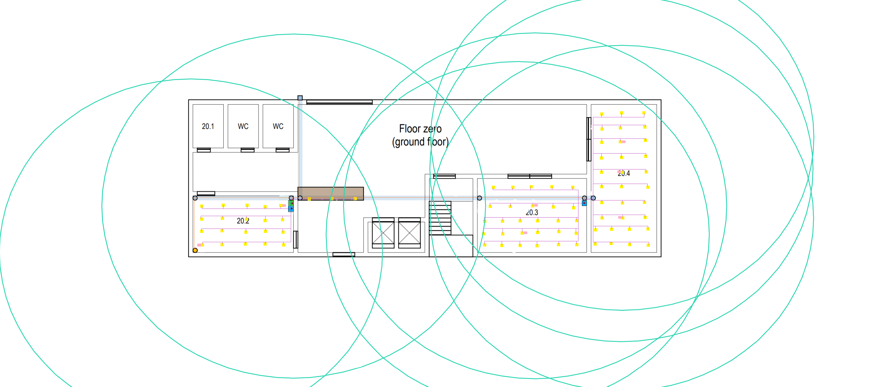
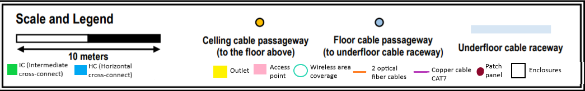
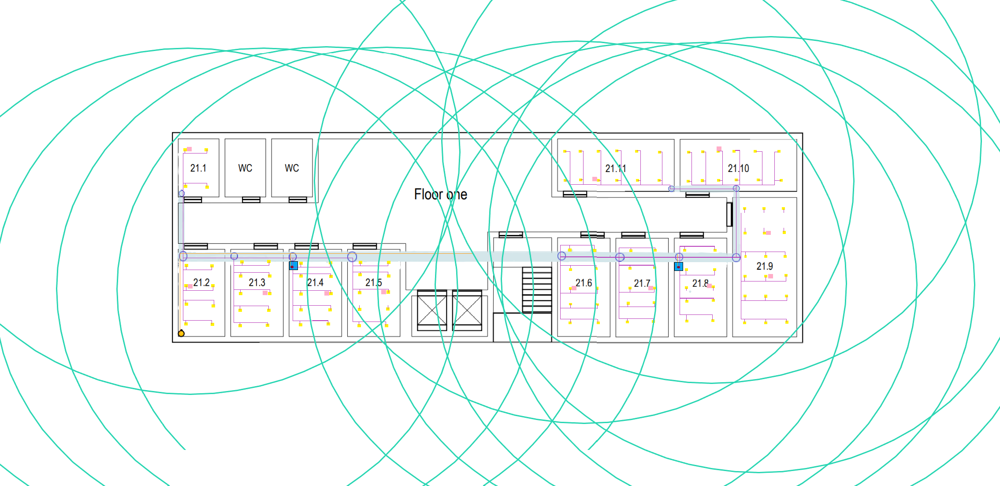
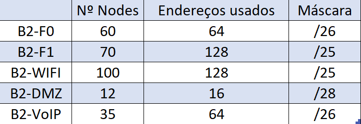
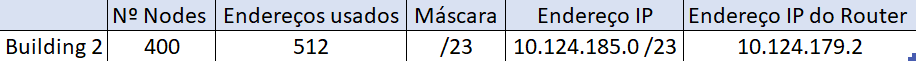
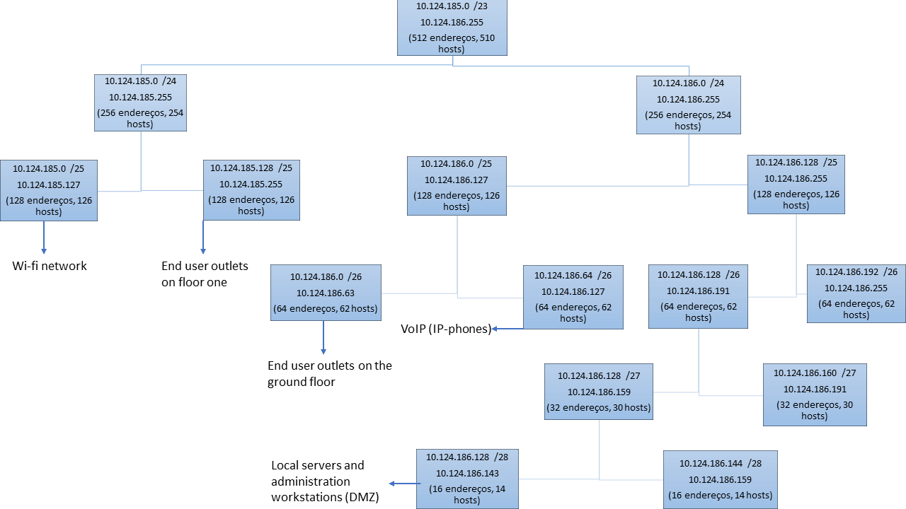
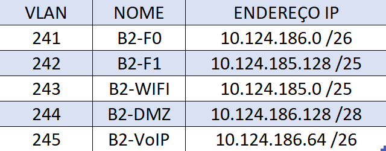
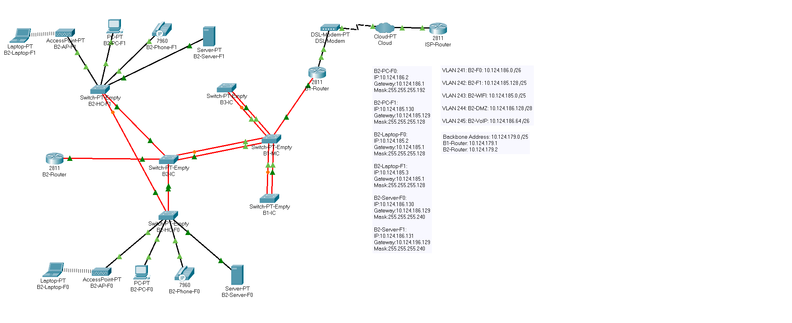
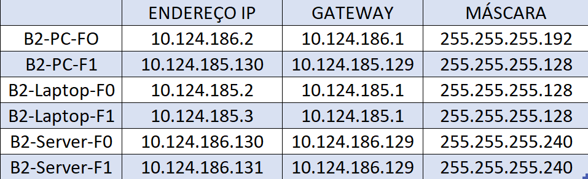

RCOMP 2020-2021 Project - Sprint 2 - Member 1190827 folder
=============================================================================

## Building 2 (Sprint 1)

Em conversa com o professor, foi pedido a cada elemento do grupo para fazer um inventário geral de cada edifício e ao Scrum Master o inventário da obra. Assim, antes de começar a procurar preços para cada equipamento do edifício 2, reformulei-o de forma a torná-lo menos dispendioso: não colocação de Consolidation Points devido aos cabos nunca alcançarem os 90 metros de comprimento nem 80 metros em linha reta. Nas imagens abaixo está a disposição de cada equipamento em cada piso do edifício 2 juntamente com a respetiva legenda.

## Invetário

 - Outlets- 197;
 - Access Points- 19;
 - IC- 1;
 - Cabos de fibra (monomode)- 302m;
 - Cabos de cobre (CAT7)- 2475m;
 - Switch de fibra (24 portas)- 1;
 - Switch híbrido (24 portas)- 4;
 - Patch panel de fibra (24 portas)- 1;
 - Patch panel de cobre (24 portas)-1;
 - Patch panel de cobre (48 portas)- 6;
 - Patch cords de fibra- 8;
 - Patch cords de cobre- 394;
 - Armários- 3 de 10U e 1 de 8U.

## Orçamento do inventário

13568,45€

## Notas sobre o inventário

Overlapping: De facto, é fundamental ter em consideração o facto das áreas de cobertura dos AP se sobreporem. As utilizações de diferentes canais de banda auxiliam nesse problema apesar de não fazer parte deste sprint. Podem ser usados canais na banda de 2,4GHz ou na banda de 5GHz. O overlapping é atenuado tendo em conta o material utilizado nas paredes. A atenuação pode ser utilizada na medida em que, se as células forem menores, devido ao material sólido existente em redor, há menos probabilidade de overlapping. Assim, foi decidido colocar um maior número de AP por piso uma vez que, para além do número elevado de equipamentos ligados às tomadas com necessidade de terem uma ligação wireless, cada utilizador pode estar ligado através de um portátil ou telemóvel. Assim, o número de ligações é maior e é necessário um maior número de AP.

De facto, foram utilizados 3 armários de 10U e 1 de 8U. No piso 0 foram utilizados 2 armários de 10U e no piso 1 foi utilizado um armário de 10U no HC do lado direito e um armário de 8U no lado esquerdo. Seguiu-se uma regra que diz que um armário deve ter 50% de espaço para além do ocupado. Por exemplo, se está 1 patch panel de 48 portas (2U) num armário, este último deve ser de 4U.

## Building 2 (Sprint 2)

## Planeamento

De facto, a atribuição dos endereços foi das primeiras coisas a serem realizadas pelo grupo de forma a se poder avançar no Sprint. Esta divisão encontra-se no planning.md e, no caso do edifício 2, o endereço atribuído foi: 10.124.185.0 /23.

## Layer three configuration

A partir do número de nodes indicado no enunciado para cada VLAN, foi calculado o número de endereços usados bem como a máscara de cada uma. Tal se pode verificar na imagem abaixo:

Assim,

- End user outlets on the ground floor: 60 nodes

	O espaço deve ser de, pelo menos, 64 endereços (prefixo de 26 bits).

- End user outlets on floor one: 70 nodes

  O espaço deve ser de, pelo menos, 128 endereços (prefixo de 25 bits).

- Wi-Fi network: 100 nodes

	O espaço deve ser de, pelo menos, 128 endereços (prefixo de 25 bits).

- Local servers e administration workstations (DMZ): 12 nodes

  O espaço deve ser de, pelo menos, 16 endereços (prefixo de 28 bits).

- VoIP (IP-phones): 35 nodes

	O espaço deve ser de, pelo menos, 64 endereços (prefixo de 26 bits).

De facto, somando todo o espaço de endereço de cada rede obtemos o espaço total de 400 (128+128+64+64+16). A partir daqui chegamos ao espaço de endereço de rede que será de 512 endereços (prefixo de 23 bits). Como se verifica na imagem abaixo, também está presente o endereço IP e o IP do router (10.124.179.2) que provém do endereço de rede do backbone definido no planning (10.124.179.0).

  

## Subnetting

Na imagem abaixo podemos encontrar a subnetting referente ao edifício 2 com a informação relativa ao: endereço de rede, endereço de broadcast, número de endereços e hosts e cada tipo de end device.

  

## VLANS

Sem dúvida que no planning foram atribuídos os números das VLANS a cada um dos edifícios. Na tabela abaixo encontra-se as 5 VLANS correspondentes ao edifício 2 contendo os seus números, nomes e endereços IP.Todas as VLANS criadas estão em todos os switches.

## Packet Tracer

Depois de efetuar todos os passos anteriormente referido iniciou-se a simulação (ficheiro "building2.pkt").

  

 - A primeira coisa a ser feita logo após se colocarem os switches referentes aos IC e HC foi: alterar o nome do domínio VTP para "rcompdhg5", colocar o IC em modo server e os HC em modo client. Como referido no enunciado, o SPT é cumprido por omissão nos switches.

 - Tirando as ligações com os end devices, todas as portas dos switches foram colocadas em trunk mode de forma a propagar a database das VLANS entre todos

 - Em cada piso, ligados a um HC (e estes ligados ao IC), foram ligados um PC, um Server, um IP Phone, um Access Point e um laptop ligado a este último. Apesar de ter 2 HC por piso, só foram representados 1 por piso.

 - Para fazer as configurações IP em cada piso nos PCs, Servers e Laptops, foi necessário, para cada, definir um endereço IP, gateway e máscara. A tabela abaixo mostra esta mesma informação juntamente com o nome dos equipamentos.

   

 - O IC está representado pelo switch com o hostname B2-IC que se encontra ligado, por fibra, a dois outros switches que representam o HC do piso 0 e do piso 1, com hostnames B2-HC-F0 e B2-HC-F1. Foi estabelecida uma ligação entre os HC para tratar a redundância.

 - De acordo com o referido acima, os switches foram configurados com portas de fibra (FFE) e portas de cobre (CGE).

 - Os end devices colocados estão ligados aos switches com a VLAN ID que representa a sua ligação, como se encontra representado anteriormente.

 - A partir daqui, e de forma a se testar a ligação à internet, foram colocados mais 3 switches: IC do edifício 1, IC do edifício 3 e MC do edifício 1. O MC representa o backbone do campus e ligou-se a um router que garante a comunicação entre todos os edifícios. Este router está ligado a um DSL-Modem que, por usa vez, está ligado a uma Cloud que, por fim, está ligada ao ISP Router. Este esquema teve por base a PL3.

 - O ISP Router tem como endereço 120.57.101.191 fornecido pelo enunciado.

 - O Router 1 tem como endereço 10.124.179.1 proveniente do endereço do backbone.

 - O Router 2 tem como endereço 10.124.179.2 proveniente do endereço do backbone.

 - O MC foi configurado em modo server e o vtp domain como rcompdhg5 (atribuído ao grupo) que é o mesmo em todos os switches. Como as ligações estão em trunk mode o MC conseguiu propagar a database das VLANS entre todos.

 - As ligações de fibra foram seguidas mediante o esquema já seguido: ligações de fibra do MC aos IC, dos IC aos HC e das cross-connects até aos routers. Só as ligações até aos routers é que não foram representadas com 2 cabos de fibra de forma a simplificar. Contudo, todas as ligações tratam a redundância.

- A partir do Router 1, todas as ligações às VLANS foram realizadas.

- De forma a não sobrecarregar a simulação, tanto os switches como os end devices representam a totalidade de dispositivos que seriam precisos:

	* B2-PC-F0: 60 nodes;

	* B2-PC-F1: 70 nodes;

	* B2-Server-F0: 6 nodes;

	* B2-Server-F1: 6 nodes;

	* B2-Phone-F0: 17 nodes;

	* B2-Phone-F1: 18 nodes;

	* B2-Laptop-F0: 50 nodes;

	* B2-Laptop-F1: 50 nodes;
