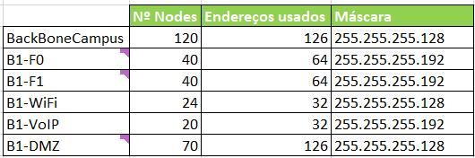
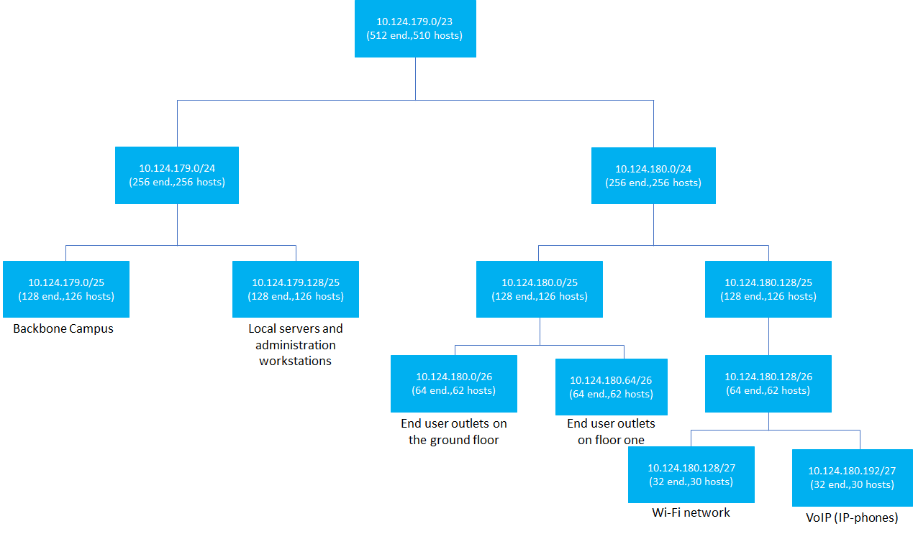
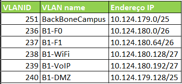
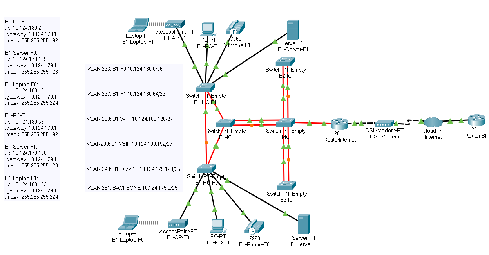
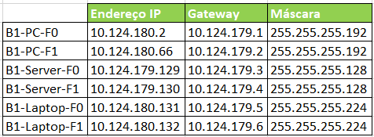

RCOMP 2020-2021 Project - Sprint 2 - Member 1191240 folder
===========================================
## Edifício 1 e Backbone

## Planeamento

De facto, a atribuição dos endereços fora das primeiras coisas a serem realizadas pelo grupo, numa reunião, assim podendo avançar no Sprint. Esta divisão encontra-se no planning.md e, no caso do edifício 2, o endereço atribuído foi: 10.124.179.0 /23.

## Layer Three Configuration

A partir do número de nodes indicado no enunciado para cada VLAN, foi calculado o número de endereços usados bem como a máscara de cada uma. Tal se pode verificar na imagem abaixo:

Assim,

- End user outlets on the ground floor: 40 nodes

	O espaço deve ser de, pelo menos, 64 endereços (prefixo de 26 bits).

- End user outlets on floor one: 40 nodes

	O espaço deve ser de, pelo menos, 64 endereços (prefixo de 26 bits).

- Wi-Fi network: 24 nodes

	O espaço deve ser de, pelo menos, 32 endereços (prefixo de 27 bits).

-Local servers and administration workstations (DMZ): 70 nodes

	O espaço deve ser de, pelo menos, 128 endereços (prefixo de 25 bits).

-VoIP (IP-phones): 20 nodes

	O espaço deve ser de, pelo menos, 32 endereços (prefixo de 27 bits).

-Backbone: 120 nodes

	O espaço deve ser de, pelo menos, 128 endereços (prefixo de 25 bits).

Sabendo disso, ao somar o número de endereços necessários seria de 448. A partir daqui chegamos ao espaço de endereço de rede que será de 512 endereços (prefixo de 23 bits).

## Subnetting

Na imagem abaixo podemos encontrar a subnetting referente ao edifício 1 e Back-Bone Campus com a informação relativa ao: endereço de rede, endereço de broadcast, número de endereços e hosts e cada tipo de end device.

  

#VLANs

A divisão de VLANs também fora divido na primeira reunião do grupo para evitar confusões e transtornos futuros, e por fim ajudou com que houvesse o avanço do trablho. 

Na tabela abaixo encontra-se as 5 VLANS correspondentes ao edifício 1 e  1 VLAN correspondente à Back-Bone Campus, contendo os VLANIDs, nome dos VLAN e os endereços. Todas as VLANS criadas estão em todos os switches.

## Packet Tracer

Depois de efetuar todos os passos anteriormente referido iniciou-se a simulação (ficheiro "Building 1.pkt").

 - A primeira coisa a ser feita logo após se colocarem os switches referentes aos IC e HC foi: alterar o nome do domínio VTP para "rcompdhg5", colocar o IC e HC em modo client e os MC em modo server. 

 - Todas as portas que faziam as ligações entre as switchs foram alteradas para trunk mode, e as restantes foram deixadas no client mode.
 - Em cada piso, ligados a um HC (e estes ligados ao IC), foram ligados um PC, um Server, um IP Phone, um Access Point e um laptop ligado a este último
 - Para fazer as configurações IP em cada piso nos PCs, Servers e Laptops, foi necessário, para cada, definir um endereço IP, gateway e máscara. A tabela abaixo mostra esta mesma informação juntamente com o nome dos equipamentos:

 - O IC está representado pelo switch com o hostname B1-IC que se encontra ligado, por fibra, a dois outros switches que representam o HC do piso 0 e do piso 1, com hostnames B2-HC-F0 e B2-HC-F1. Foi estabelecida uma ligação entre os HC para tratar a redundância.

 - De acordo com o referido acima, os switches foram configurados com portas de fibra (FFE) e portas de cobre (CFE).

 - Os end devices colocados estão ligados aos switches com a VLAN ID que representa a sua ligação, como se encontra representado anteriormente.

 - A partir daqui, e de forma a se testar a ligação à internet, foram colocados mais 2 switches: IC do edifício 2 e IC do edifício 3. Este router está ligado a um DSL-Modem que, por usa vez, está ligado a uma Cloud que, por fim, está ligada ao ISP Router. Este esquema teve por base a PL3.

 - O ISP Router tem como endereço 120.57.101.191 fornecido pelo enunciado.

 - O Router 1 tem como endereço 10.124.179.2 proveniente do endereço do backbone.

 - O MC foi configurado em modo server e o vtp domain como rcompdhg5 (atribuído ao grupo) que é o mesmo em todos os switches. Como as ligações estão em trunk mode o MC conseguiu propagar a database das VLANS entre todos.

 - As ligações de fibra foram seguidas mediante o esquema já seguido: ligações de fibra do MC aos IC, dos IC aos HC e das cross-connects até aos routers. Só as ligações até aos routers é que não foram representadas com 2 cabos de fibra de forma a simplificar. Contudo, todas as ligações tratam a redundância.

 - A partir do Router 1, todas as ligações às VLANS foram realizadas.
- De forma a não sobrecarregar a simulação, tanto os switches como os end devices representam a totalidade de dispositivos que seriam precisos:

	* B2-PC-F0: 40 nodes;

	* B2-PC-F1: 40 nodes;

	* B2-Server-F0: 35 nodes;

	* B2-Server-F1: 35 nodes;

	* B2-Phone-F0: 10 nodes;

	* B2-Phone-F1: 10 nodes;

	* B2-Laptop-F0: 12 nodes;

	* B2-Laptop-F1: 12 nodes;