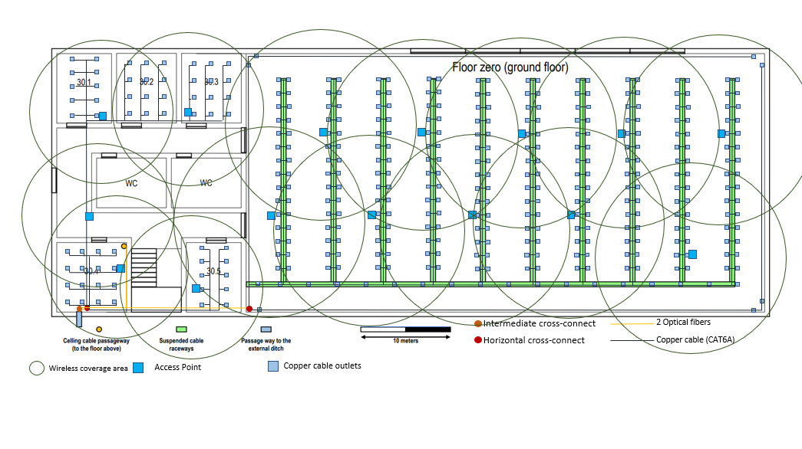
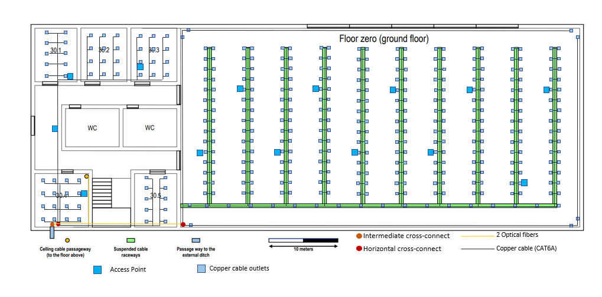
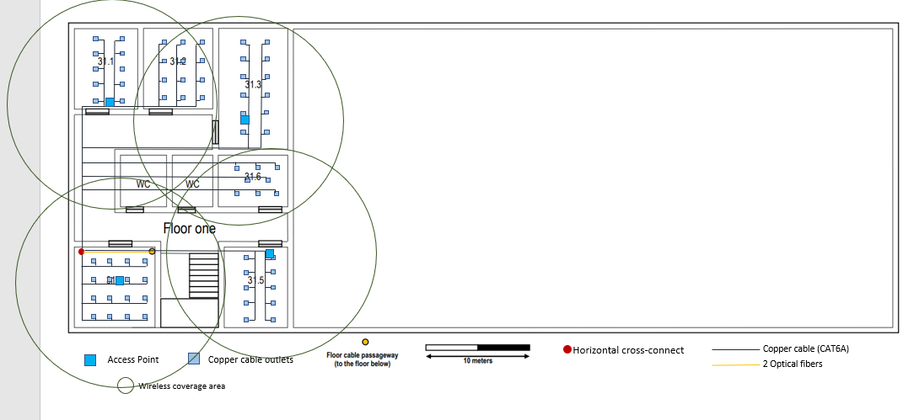
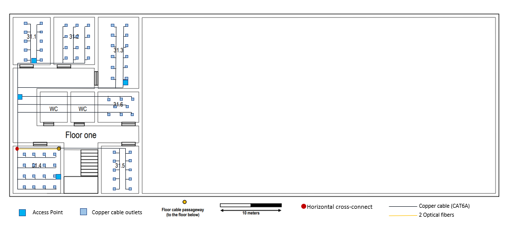
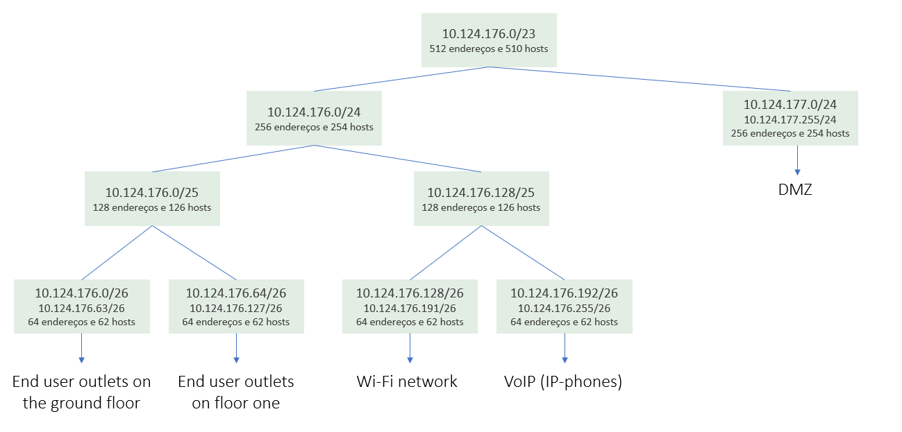
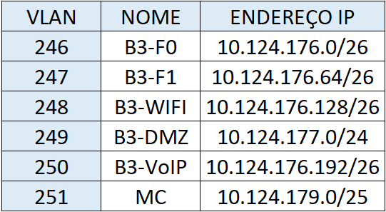
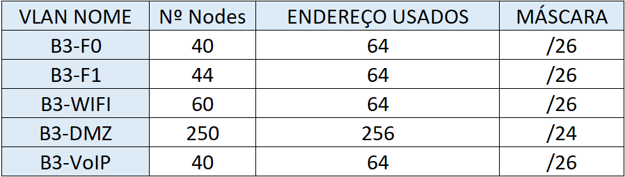
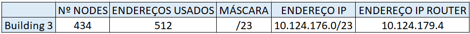
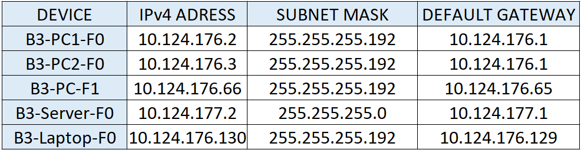
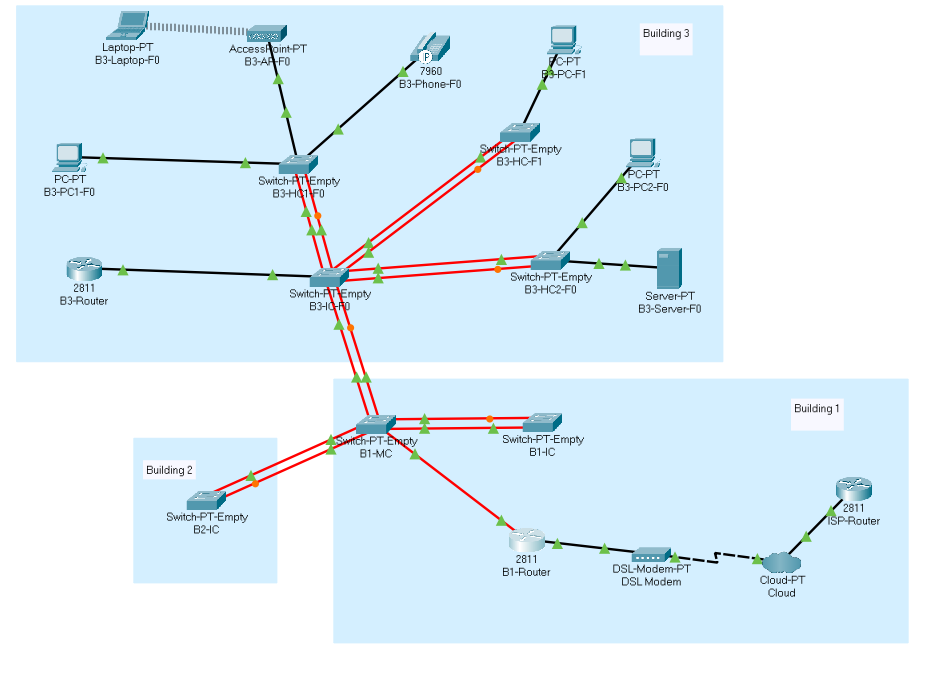

RCOMP 2019-2020 Project - Sprint 2 - Member 1191596 folder
=============================================================================

Em relação ao Spint1, houve algumas alterações no edifício 3. Retirei todos os
consolidation points, não era necessário uma vez que a partir dos horizontal
cross connects era possível chegar a todos os outlets, com uma distância menor
que 90 metros. Também todos os cabos CAT7 foram substituídos por cabos CAT6A,
com o objetivo de evitar interferência eletromagnética que pode acontecer com
os cabos CAT7. E por fim, acrescentei mais access points, já que cada um permite
ser usado por mais ou menos 30 utilizadores. No entanto, como se pode ver na figura a baixo, a cobertura dos AP se sobrepõem, algo que não se deve fazer mas neste momento ainda não nos foi ensinado a colocar os AP's de forma a não ocorrer overlapping.

## Building3 - Legenda

## Invetário

• Outlet: 382 unidades    
• Cabo cobre (CAT6A): 9212 metros      
• Cabo fibra ótica: 78 metros  
• Access Point: 19 unidades  
•	Switch de fibra de 16 portas: 1 unidade  
•	Switch de cobre de 48 portas: 16 unidades   
• Switch híbrido de 24 portas: 3 unidades   
• Patch Cords de cobre: 764 unidades  
• Patch cords de fibra: 12 unidades  
• Patch Panel de fibra de 16 portas: 1 unidade    
• Patch Panel de cobre de 48 portas: 16 unidades  
• Réguas de organização de cabos: 76 unidades   
• Réguas de powers: 50 unidades   
• Power panels: 1 unidades   
• Bastidores rack 19: 1 unidade   
• Bastidores rack 10: 2 unidades    

## Orçamento do inventário

62831.4€

## Building 3 - Sprint 2

## Planeamento

Primeiro começamos por atribuír os blocos de endereços de cada um,  distrubír os id's das Vlans por todos, definir os endereços dos routers, bem como o nome que vamos dar a cada dispositivo. Tudo isto se encontra no planing.md.

## Virtual LANs

Como default VLAN, nós deixamos estar a VLANID 1 que já estava predefinida no packet tracer.

## Subnetting

No enunciado foram nos dado o número de nodes que teriamos de atribuír a cada VLAN. Utilizando a rede que foi atribuída ao edifício 3 e o método de divisão de redes, atribuí um endereço de rede IPv4 a cada VLAN.

#### Divisão da rede -> 10.124.176.0/23

#### Vlans e respetivos endereços

#### Vlans e respetivos nodes e endereços endereçosUsados

#### Building 3 nodes

## Packet Tracer

 No Packet Tracer comecei por colocar os switchs (PT-Empty como indicado no enunciado) referente ao IC e aos HC's no edificio 3.
 Alterei a vtp domain para rcompdhg5 e coloquei todos os switchs com exceção do switch do intermediate cross connect (que tem que estar em server mode -default mode do packet tracer-) em client mode. Assim depois de colocar todas as vlans no switch do IC e de colocar todas as ligações entre switches em trunk mode, todos os switches ficaram a conter a mesma database.

 Em seguida, liguei diferentes dispositivos (escolhidos no enunciado) aos HC's do edificio. À exceção do VoIP phone e do access-point, foram configurados os Ip's dos restantes dispositivos.

Para a ligação com o VoIP phone tive que configurar as portas do switch correspondentes ao modo de acesso para o modo voice vlan.
Os restantes dispositivos foram conectados às VLANs corretas, configurando as portas de switch correspondentes em
modo de acesso, e atribuíndo a eles as VLANs corretas.

O switch do IC foi configurado com portas de fibra (FFE) para ligar aos outros switches e com uma porta de cobre (CGE) para ligar ao router. Outros foram configurados com portas de fibra (FFE) para ligar aos switches e com portas de cobre (CFE) para ligar aos dispositivos.

O ISP Router tem como endereço 120.57.101.191.

O Router MC tem como endereço 10.124.179.1 proveniente do endereço do backbone e 120.57.101.191 na ligação com o ISP router.
O Router 2 tem como endereço 10.124.179.4 proveniente do endereço do backbone.

#### Simulation Building 3

## Notas
• Houve um problema, não foi possível colocar a máscara /23 quando estava a colocar o endereço 120.57.101.191/30 do Router ISP e o endereço 120.57.101.190/30 no Router MC.

• Quando houve a ligação com o MC de edifício 1, como este está  configurado em modo server e o vtp domain como rcompdhg5 a database das VLANS do MC espalhou por todos os switches. E tive que colocar de novo as Vlans no switch IC (o server do building 3).

• No packet tracer a redundância nas ligações de fibra está lá. No entanto, a redundância nas restantes ligações não foram representadas, tal como a totalidade de dispositivos, de forma a simplificar a simulação e também porque o packet tracer pode não aguentar.
