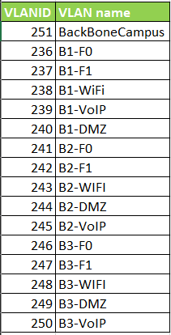
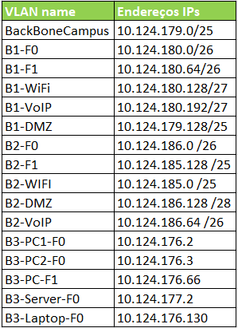

RCOMP 2019-2020 Project - Sprint 2 planning
===========================================
### Sprint master: 1191240 ###
This document includes the sprint's backlog summary, general technical decisions regarding the coordination of the requested tasks, and finally, the task assigned to each team member.

# 1. Sprint's backlog  summary#
In this sprint the focus is on the layer twoinfrastructure, and the layer three fundamentals, so for this sprint the Cisco Packet Tracer tool must be used.

# 2. Technical decisions and coordination #
###### Cisco Packet Tracer version: 8.0.0.0212 ######

#### VTP configuration ####
* The VTP domain name should be: rcompdhg5.
* The VLANIDs range to use was: 235 -265.
* Table of VLANIDs and it's names:

* The IPs inicial is: 10.124.176.0/20
* Table of IPs:

#### Device naming: ####

To naming the devices we decide define the name this example following  format:

B1-HC-F1
*	B1-> Building + number of the building.
*	HC-> Name of what the device is representing.
*	F0-> Floor + number of the floor.

#### Devices used: ####

* Switch-PT(Empty): to represent the cross-connect(HC, IC e/ou MC). So after that we fill the ports that are empty, with fiber ports and/or copper cable ports.
* IP-Phones(7960): to represent ip-phones.
* Acess-Point: to represent the acess-points in the building, one in each floor.
* Server-PT: to represent a server.
* Laptop-PT: to represent the devices that will connect to the acess points.
* Router: to represent the router that will connect the Campus to the internet.
* Modem: to permit the connection from the router to the internet.

#### VLAN naming: ####
To naming the vlans we decide define the name this examples.

For the end-user vlan:
 - B1-F0:
  - B1 -> B + number of the building.
  - F0 -> F + number of the floor.

For the others vlan:
 - B1-DMZ:
  - B1  -> B + number of the building.
- DMZ -> Name of type of device.

# 3. Subtasks assignment #

* Task 2.1 - Danilton Lopes(1191240)  
 Development of a layer two and layer three Packet Tracer simulation for building 1, and also encompassing the campus backbone.
Integration of everymembers’ Packet Tracer simulations into a single simulation.

* Task 2.2 - Luís Araújo - Development of a layer two and layer three Packet Tracer simulation forbuilding 2, and also encompassing the campus backbone.

* Task 2.3 - Marisa Pereira - Development of a layer two and layer three Packet Tracer simulation for building 3, and also encompassing the campus backbone.
