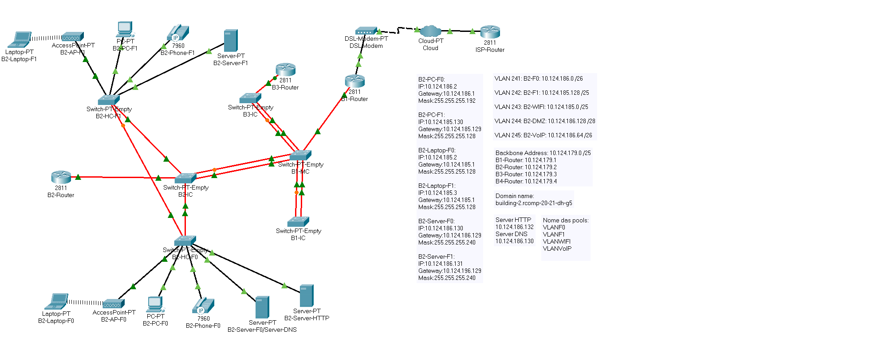
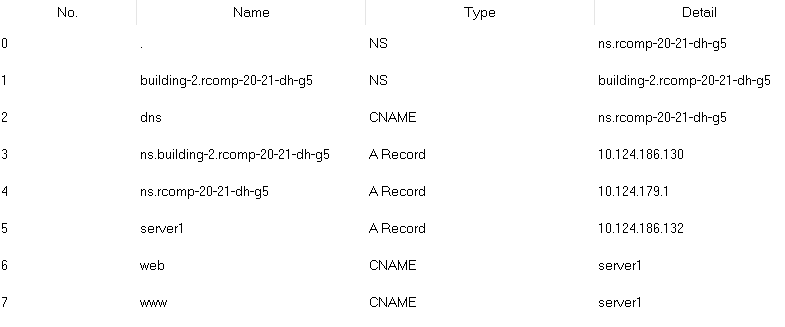
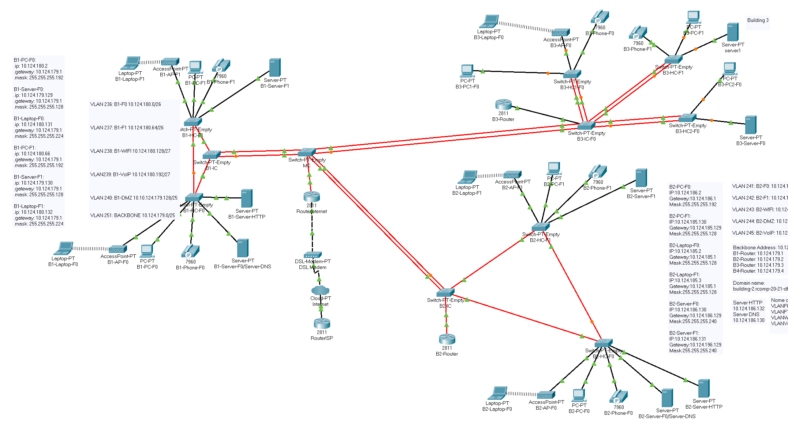

RCOMP 2020-2021 Project - Sprint 3 - Member 1190827 folder
===========================================
# Building 2  

## Planeamento

De facto, o Sprint 3 utilizou todos os componentes e definições do Sprint 2 tendo, depois, as atualizações pedidas.

Inicialmente, o grupo decidiu todos os ids para as áreas OSPF, os prefixos dos telefones em cada edifício, os nomes de domínio do DNS em cada edifício bem como os seus endereços e o nome dos servers:

* Building B OSPF area id - 2
* Backbone OSPF area id - 0
* VOIP prefix F0 - 200
* VOIP prefix F1 - 201
* DNS domain name - building-2.rcomp-20-21-dh-g5
* DNS server name - ns.building-2.rcomp-20-21-dh-g5
* Dns server ip de rede- 10.124.186.128/28

Como evidenciado no enunciado, o server do piso 0 já existente foi utilizado para ter o serviço DNS com o endereço 10.124.186.130.

## Projeto

Simulação do edifício:

Inicialmente, e em conversa com o professor, foram adicionadas as interfaces relativamente às VLANS e ao backbone.  

Desde já, outra mudança que o edifício teve foi o acréscimo do router do edifício 3 para se testar depois as rotas dinâmicas.

### OSPF dynamic routing

Todas as áreas dos diferentes edifícios estão ligadas à area 0 (backbone).

Foram feitos os mesmos passos em cada router, apenas mudando as networks internas e o número da área onde serão colocadas.

        router ospf 2
        network router-backboneAddress wildcard area 0
        network network-address network-wildcard area 2

### HTTP servers

Como pedido no enunciado, foi adicionado outro servidor na VLAN DMZ para assumir o serviço de HTTP.

Nos serviços desse server com o serviço HTTP, foi adicionado uma página HTML- "Welcome to Building 2!".

### DHCPv4 service

De facto, foram adicionadas 4 VLANS com DHCP no router: todas exceto a DMZ e a do backbone.

Na configuração do VoIP, a opção 150 foi utilizada como pedido no enunciado.

Nomes das pools usadas:
    * VLANF0;
    * VLANF1;
    * VLANWIFI;
    * VLANVoIP.

Após a configuração de DHCP em cada VLAN foi feita a exclusão do ip dessa VLAN no router

        ip dhcp excluded-address ip_router

Todos os pcs e laptops passaram a receber a configuração por DHCP.

### VoIP service

Nas portas dos switches ligadas aos telefones foi ativado o respetivo voice vlan ativado e o access vlan desativado.

Como o DHCP já estava configurado só foi necessário configurar o serviço de telefonia (número max-ephones=42/max-dn=144) e o número de telefone de cada um:

        ephone-dn 1
        number 200
        ...

O último passo foi preparar as chamadas entre edifícios onde foi usado o comando dial-peer voice. O padrão escolhido para reconhecer números do edifício 1 foi 1.. e para o edifício 3 foi 3.. . Cada padrão é reencaminhado para o router do respetivo edifício

### DNS

Na configuração do DHCP, foi definido para cada end-node exceto os servers, o dns server e o dns domain name.

O elemento do grupo com o edifício 1 utilizou um nome de domínio para ser o nível mais alto e foi usado como a raiz de domínio do DNS.

Foram criados records confome o pedido no enunciado:

Aos restantes servidores foi adicionado o dns server manualmente.

### NAT (Network Address Translation)

Foram efetuados os comandos que constam no ficheiro de configuração do router C para cada porta pedida no enunciado, 80 (HTTP), 443(HTTPS) e 53(DNS).

Depois colocou-se cada VLAN, exceto a da Backbone, "inside" da NAT criada.

        ip nat inside
        ip nat outside

### Static Firewall (ACLs)

Comandos ACLS: no fichiro "Comandos ACL.txt".  

### Erros

Ao tentar aceder à página HTML criada, o device usado não mostrava nada. Este erro apareceu repentinamente uma vez que, no ISEP, não deu problema nenhum. 

# Campus

Depois de todos os elementos do grupo terem realizado os respetivos projetos no Packet Tracer, iniciou-se a simulação do backbone num novo projeto.

