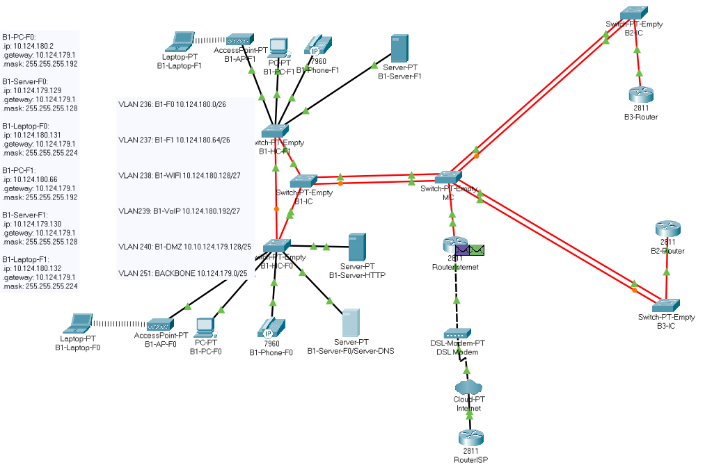
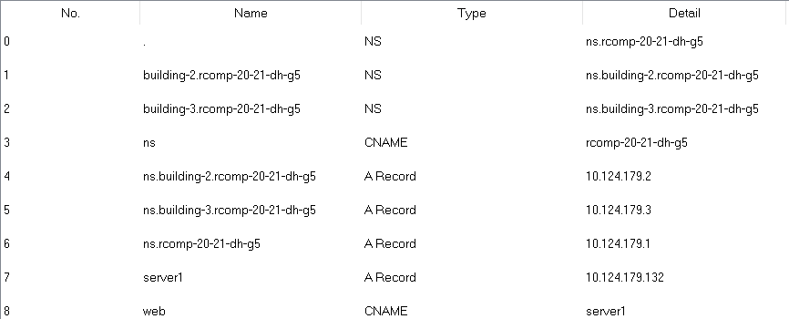

RCOMP 2019-2020 Project - Sprint 3 - Member 1191240 folder
===========================================
(This folder is to be created/edited by the team member 1191240 only)

#### Edifício A ####
Neste sprint, foram mantidas todas as definições do projeto .pkt do sprint2 para
ser usado como base do projeto novo, exceptos a eliminação de static routing.

Definiu-se os ids para as areas OSPF, os prefixos dos telefones, os nomes de
domínio de DNS, o nome do Server DNS e o respetivo endereço dos edifícios, no
planning.md, pelo que para o edifício 1:

-  Building 1 OSPF area id - 1

-   Backbone OSPF area id - 0

-   VOIP prefix F0 - 100

-   VOIP prefix F1 - 101

-   DNS domain name - rcomp-20-21-dh-g5

-   DNS server name - ns.rcomp-20-21-dh-g5

-   Dns server ip de rede- 10.124.179.128/25

>   Como pedido no enunciado, um dos servers ja existente no sprint2 passou a
>   ter o servico DNS, pelo que o endereço aplicado ao DNS é 10.124.179.131.

Projeto PKT
-----------

Após todas as considerações em cima referidas, iniciou-se a simulação no Packet
Tracer.

~~~~~~~~~~~~~~~~~~~~~~~~~~~~~~~~~~~~~~~~~~~~~~~~~~~~~~~~~~~~~~~~~~~~~~~~~~~~~~~~
Simulação completa .pkt do Edifício 1
~~~~~~~~~~~~~~~~~~~~~~~~~~~~~~~~~~~~~~~~~~~~~~~~~~~~~~~~~~~~~~~~~~~~~~~~~~~~~~~~
Para começar, foram adicionados os routers dos edifícios 2 e 3, para testar
as rotas routing entre edifícios, desta vez com rotas dinâmicas(OSPF);

### OSPF dynamic routing

-   O primeiro passo foi apagar as rotas estáticas entre os edifícios, exceto a
    rota default com ligação ao ISP.

-   Todas as áreas dos diferentes edifícios estão ligadas à area 0 (backbone).

-   Foram feitos os mesmos passos em cada router, apenas mudando as networks
    internas e o número da área onde serão colocadas.

    ~~~~~~~~~~~~~~~~~~~~~~~~~~~~~~~~~~~~~~~~~~~~~~~~~~~~~~~~~~~~~~~~~~~~~~~~~~~~
      router ospf 1
      network router-backboneAddress wildcard area 0
      network network-address network-wildcard area x
      ...
    ~~~~~~~~~~~~~~~~~~~~~~~~~~~~~~~~~~~~~~~~~~~~~~~~~~~~~~~~~~~~~~~~~~~~~~~~~~~~

### HTTP

-   Foi colocado um servidor na VLAN DMZ para assumir o serviço de HTTP

-   Foi adicionado a uma pagina HTML um identificador do Edifício (Ex. Edifício
    1!)

### DHCPv4

-   Há 4 VLANS com DHCP configurado no próprio router. Todas menos a DMZ e a
    BACKBONE.

-   A configuração do VOIP foi feita com a optção 150, como pedido no enunciado

-   Os nomes das pools usados foram:

    -   VLANF0B1

    -   VLANF1B1

    -   VLANWIFIB1

    -   VLANVOIPB1

-   Após a configuração de DHCP em cada VLAN foi feita a exclusão do ip dessa
    VLAN no router

    ~~~~~~~~~~~~~~~~~~~~~~~~~~~~~~~~~~~~~~~~~~~~~~~~~~~~~~~~~~~~~~~~~~~~~~~~~~~~
      ip dhcp excluded-address ip_router
    ~~~~~~~~~~~~~~~~~~~~~~~~~~~~~~~~~~~~~~~~~~~~~~~~~~~~~~~~~~~~~~~~~~~~~~~~~~~~

### VOIP

-   Nas portas dos switches ligadas aos telefones foi ativado o respectivo voice
    vlan ativado e o access vlan desactivado.

-   Como o DHCP já estava configurado só é necessário configurar o serviço de
    telefonia, onde foi definido o número max-ephones, sendo 2, e o número de
    telefone de cada um:

    ~~~~~~~~~~~~~~~~~~~~~~~~~~~~~~~~~~~~~~~~~~~~~~~~~~~~~~~~~~~~~~~~~~~~~~~~~~~~
      ephone-dn 1
      number 100
      ephone-dn 2
      number 101
    ~~~~~~~~~~~~~~~~~~~~~~~~~~~~~~~~~~~~~~~~~~~~~~~~~~~~~~~~~~~~~~~~~~~~~~~~~~~~

### DNS

-   Na configuração do DHCP já foi definido para cada end-node exceto os
    servidores, o dns server e o dns domain name pelo que já todos conhecem o
    servidor dns

-   O membro do grupo com o edifício A criou um nome de domínio que vai ser o
    nível mais alto, por isso foi usado como a raiz de domínio do DNS

-   Foram criados records confome o pedido no enunciado:

~~~~~~~~~~~~~~~~~~~~~~~~~~~~~~~~~~~~~~~~~~~~~~~~~~~~~~~~~~~~~~~~~~~~~~~~~~~~~~~~
  DNS Database
~~~~~~~~~~~~~~~~~~~~~~~~~~~~~~~~~~~~~~~~~~~~~~~~~~~~~~~~~~~~~~~~~~~~~~~~~~~~~~~~

-   Aos restantes servidores foi adicionado o dns server manualmente

### NAT

-   Foram efetuados os comandos que constam no ficheiro de configuração do
    router A para cada porta pedida no enunciado, 80 (HTTP), 443(HTTPS) e
    53(DNS).

-   Depois colocou-se cada VLAN, exceto a da Backbone, "inside" da NAT criada.

    ~~~~~~~~~~~~~~~~~~~~~~~~~~~~~~~~~~~~~~~~~~~~~~~~~~~~~~~~~~~~~~~~~~~~~~~~~~~~
      ip nat inside
      ip nat outside
    ~~~~~~~~~~~~~~~~~~~~~~~~~~~~~~~~~~~~~~~~~~~~~~~~~~~~~~~~~~~~~~~~~~~~~~~~~~~~

### ACLs

-   Um aspeto importante a referir é que todas as regras foram inseridas pela
    ordem pedida no enunciado!

 

